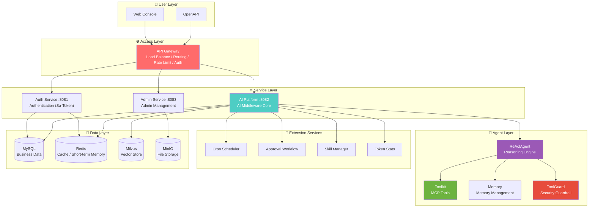
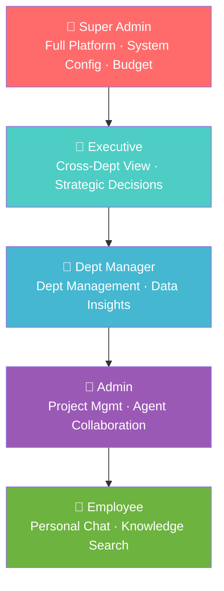
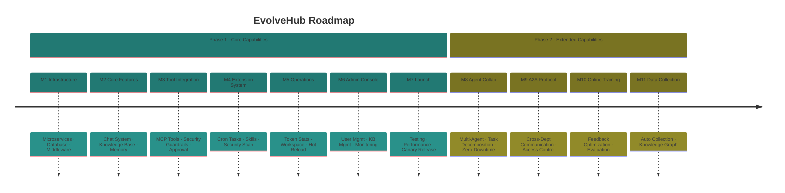

<div align="center">

<!-- Header Wave -->


<!-- Logo -->
<picture>
  <source media="(prefers-color-scheme: dark)" srcset="docs/logo.svg">
  <source media="(prefers-color-scheme: light)" srcset="docs/logo.svg">
  
</picture>

<br/>

<!-- Animated Title -->
<h1>
  
</h1>

<!-- Subtitle -->
<p>
  
</p>

**Empower every employee to converse with business systems through natural language**

<br/>
<br/>

<!-- Badge Wall -->
<p>
  
  
  
  
</p>

<p>
  
  
  
</p>

<p>
  <a href="README_zh.md">
    
  </a>
</p>

<!-- Footer Wave -->


</div>

---

## 🎯 What is EvolveHub?

<div align="center">

| 🧬 | **EvolveHub = Enterprise AI Middleware Platform** |
|:--:|:-------------------------------------------------|

</div>

> **EvolveHub** is an enterprise AI middleware service system built on **AgentScope-Java**. Through a unified AI capability access layer, departments can quickly integrate intelligent conversation, knowledge base retrieval and other AI capabilities by connecting **MCP services** or **A2A protocol** + **Skills packages**, without redundant development.

<br/>

<div align="center">

### 🪄 Core Values

| Unified Access | Knowledge Accumulation | Intelligent Conversation | Security & Control |
|:--------------:|:----------------------:|:------------------------:|:------------------:|
| Fast integration via MCP/A2A | Centralized knowledge base, intelligent retrieval | Natural language interaction, tool execution, task automation | Multi-level permissions, on-premise deployment |

</div>

---

## 🏗️ Platform Architecture

<div align="center">



</div>

---

## ✨ Phase 1 Core Features

<div align="center">

<table>
<tr>
<td width="33%" valign="top">

### 💬 Smart Conversation


- Multi-turn dialogue + context
- ReAct reasoning engine
- SSE streaming output
- Auto intent routing

</td>
<td width="33%" valign="top">

### 📚 Knowledge Base


- 4 tiers: Global / Dept / Project / Sensitive
- RAG retrieval-augmented generation
- Permission filtering + semantic search
- Auto document chunking & vectorization

</td>
<td width="33%" valign="top">

### 🧠 Memory System


- Short-term (Redis, 30min TTL)
- Long-term (Mem0 + Milvus)
- User config (MinIO)
- Sleep consolidation

</td>
</tr>
<tr>
<td width="33%" valign="top">

### 🔧 Tool Execution


- MCP protocol integration
- Built-in CLI toolset
- Security guardrail (ToolGuard)
- Injection / traversal detection

</td>
<td width="33%" valign="top">

### 🤖 Model Management


- Cloud: Qwen / OpenAI / Gemini / Claude
- Local: Ollama / vLLM
- Embedding: Qwen3 / bge
- Web UI dynamic switching

</td>
<td width="33%" valign="top">

### ⏰ Cron Scheduler


- Cron expression scheduling
- Heartbeat + zombie task recovery
- Concurrency control
- Full status tracking

</td>
</tr>
<tr>
<td width="33%" valign="top">

### ✅ Approval Workflow


- High-risk operation interception
- Web confirm + admin approval
- Auto expiry (24h default)
- GC mechanism

</td>
<td width="33%" valign="top">

### ⚡ Skills Extension


- Built-in: DOCX / PDF / PPTX / XLSX
- Upload + security scan
- Lifecycle management
- Sandbox isolation

</td>
<td width="33%" valign="top">

### 📊 Token Statistics


- By user / dept / model stats
- Budget control + alerts
- Usage report export
- Cost trend analysis

</td>
</tr>
</table>

</div>

---

## 🔐 Role-Based Access Control

<div align="center">



</div>

---

## 🚀 Use Cases

<div align="center">

| Scenario | Description | Key Capability |
|:--------:|:------------|:--------------:|
| 💬 **Smart Customer Service** | AI understands business, auto-queries orders, handles tickets | Chat + MCP Tools |
| 📊 **Data Assistant** | Natural language database queries, report generation | Knowledge Base + RAG |
| 🔧 **Ops Assistant** | AI executes operations, auto-troubleshoots | Tool Execution + Approval |
| 📋 **Workflow Approval** | Intelligent approval understanding, decision support | Workflow + Guardrails |
| 🎓 **Training Tutor** | Q&A based on enterprise knowledge base | Knowledge Base + Memory |
| 📈 **Scheduled Reports** | Auto-generate daily/weekly reports, push notifications | Cron + Skills |

</div>

---

## 🔌 Integration Methods

### Method 1: MCP Protocol

Configure your MCP service endpoint, platform auto-discovers and loads tools:

```yaml
# evolvehub-config.yaml
mcp:
  servers:
    - name: "company-erp"
      endpoint: "https://erp.company.com/mcp"
      auth:
        type: "bearer"
        token: "${ERP_API_TOKEN}"
```

### Method 2: A2A Protocol

Register your Agent to A2A network for multi-agent collaboration:

```yaml
a2a:
  registry: "nacos://localhost:8848"
  agents:
    - name: "order-agent"
      capability: "Order Query & Processing"
    - name: "inventory-agent"
      capability: "Inventory Management"
```

### Method 3: Skills Packages

Import pre-built enterprise skill packages for instant business capabilities:

```yaml
skills:
  - name: "database-query"
    version: "1.0.0"
  - name: "report-generator"
    version: "2.1.0"
```

---

## 🛠️ Tech Stack

<div align="center">


</div>

| Component | Technology | Version | Description |
|:---------:|:----------:|:-------:|:------------|
| Agent Framework | AgentScope-Java | 1.0.11 | Core Agent Engine (ReAct) |
| Backend Framework | Spring Boot | 3.2+ | Microservice Framework |
| JDK | OpenJDK | 21 | LTS |
| Authentication | Sa-Token | 1.37+ | Lightweight Auth Framework |
| Cache | Redis | 8.x | Short-term Memory + Cache + Queue |
| Vector Database | Milvus | 2.x | Knowledge Base Vector Storage |
| Relational Database | MySQL | 8.0+ | Business Data Storage |
| File Storage | MinIO | Latest | Document / User Config Storage |

---

## 🆚 Comparison with Traditional Solutions

<div align="center">

| Dimension | Traditional AI Development | **EvolveHub** |
|:---------:|:--------------------------:|:-------------:|
| Development Cost | 🔴 High (needs AI engineers) | 🟢 Zero-code config |
| Deployment Time | 🔴 Weeks/Months | 🟢 Minutes |
| Business Adaptation | 🔴 Custom development | 🟢 MCP/A2A plug-and-play |
| Knowledge Building | 🔴 Static Prompts | 🟢 Auto-evolution + sleep consolidation |
| Security Control | 🔴 Manual review | 🟢 Guardrails + approval workflow |
| Maintenance Cost | 🔴 Continuous investment | 🟢 Self-adaptive optimization |

</div>

---

## 📦 Deployment Options

<div align="center">

| Deployment Mode | Use Case | Features |
|:---------------:|:--------:|:--------:|
| 🐳 **Docker** | Quick trial, test environments | One-click startup |
| ☸️ **Kubernetes** | Production, high availability | Elastic scaling |
| 🏢 **On-Premise** | Data-sensitive, compliance | Full control |

</div>

### Docker Quick Start

```bash
# Pull image
docker pull evolvehub/server:latest

# Start service
docker run -d \
  --name evolvehub \
  -p 8080:8080 \
  -v ./config:/app/config \
  evolvehub/server:latest

# Visit http://localhost:8080 to start using
```

---

## 📈 Roadmap



---

## 🤝 Join the Community

<div align="center">

### 📱 Scan to Join DingTalk Group


*Product Inquiry · Technical Discussion · Feedback*

<br/>

</div>

---

## 📄 License

<div align="center">

[](https://opensource.org/licenses/MIT)

</div>

---

<div align="center">

**Made with ❤️ by the EvolveHub Team**


</div>
