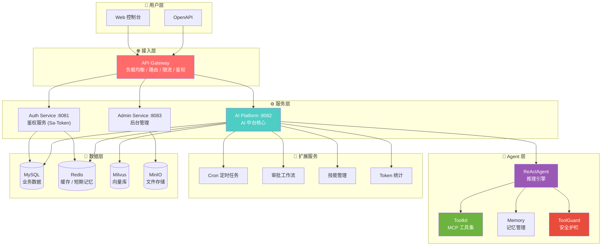
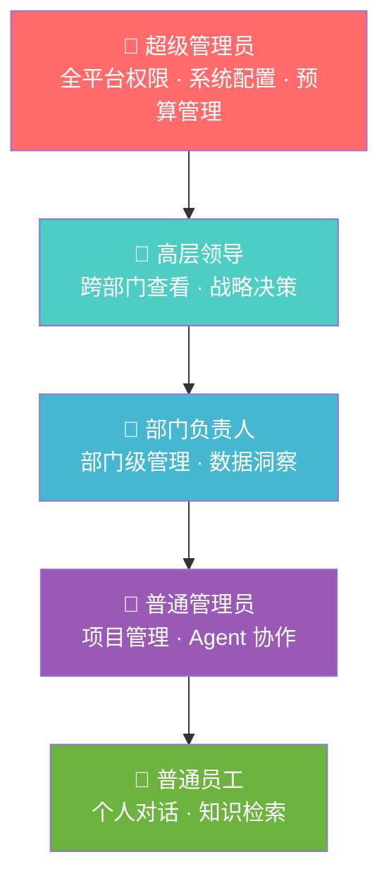
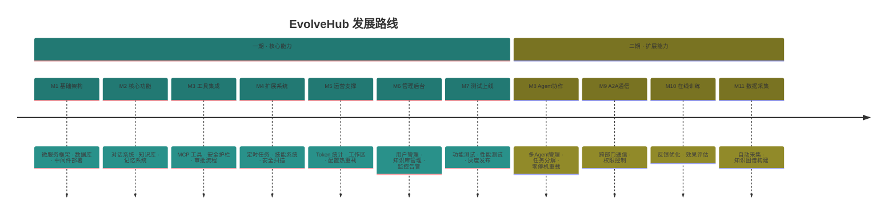

<div align="center">

<!-- 顶部装饰线 -->


<!-- Logo -->
<picture>
  <source media="(prefers-color-scheme: dark)" srcset="docs/logo.svg">
  <source media="(prefers-color-scheme: light)" srcset="docs/logo.svg">
  
</picture>

<br/>

<!-- 动态标题 -->
<h1>
  
</h1>

<!-- 副标题 -->
<p>
  
</p>

**让每个员工都能通过自然语言与业务系统对话，让企业知识触手可及**

<br/>
<br/>

<!-- 徽章墙 -->
<p>
  
  
  
  
</p>

<p>
  
  
  
</p>

<p>
  <a href="README.md">
    
  </a>
</p>

<!-- 底部装饰线 -->


</div>

---

## 🎯 什么是 EvolveHub？

<div align="center">

| 🧬 | **EvolveHub = 企业级 AI 中台** |
|:--:|:-------------------------------|

</div>

> **EvolveHub** 是面向企业的 AI 中台服务系统，基于 **AgentScope-Java** 框架构建。通过统一的 AI 能力接入层，各部门产品只需接入 **MCP 服务**或 **A2A 协议** + **Skills 技能包**，即可快速集成智能对话、知识库检索等 AI 能力，无需重复开发。

<br/>

<div align="center">

### 🪄 核心价值

| 统一接入 | 知识沉淀 | 智能对话 | 安全可控 |
|:--------:|:--------:|:--------:|:--------:|
| 各部门通过 MCP/A2A 快速接入 | 企业知识库集中管理，智能检索 | 自然语言交互，工具执行，任务自动化 | 多级权限，私有化部署，数据不出域 |

</div>

---

## 🏗️ 平台架构

<div align="center">



</div>

---

## ✨ 一期核心功能

<div align="center">

<table>
<tr>
<td width="33%" valign="top">

### 💬 智能对话


- 多轮对话 + 上下文理解
- ReAct 推理引擎
- SSE 流式输出
- 意图识别自动路由

</td>
<td width="33%" valign="top">

### 📚 知识库


- 4 层分级：全局 / 部门 / 项目 / 敏感
- RAG 检索增强生成
- 权限过滤 + 语义检索
- 文档自动切片向量化

</td>
<td width="33%" valign="top">

### 🧠 记忆系统


- 短期记忆 (Redis, 30min TTL)
- 长期记忆 (Mem0 + Milvus)
- 用户配置 (MinIO)
- 睡眠整理机制

</td>
</tr>
<tr>
<td width="33%" valign="top">

### 🔧 工具执行


- MCP 协议集成企业工具
- 内置 CLI 工具集
- 安全护栏 (ToolGuard)
- 命令注入 / 路径穿越检测

</td>
<td width="33%" valign="top">

### 🤖 模型管理


- 云端：通义千问 / OpenAI / Gemini / Claude
- 本地：Ollama / vLLM
- 向量模型：Qwen3 / bge
- Web 界面动态切换

</td>
<td width="33%" valign="top">

### ⏰ 定时任务


- Cron 表达式调度
- 心跳检测 + 僵尸任务回收
- 并发控制（单实例运行）
- 任务状态全程追踪

</td>
</tr>
<tr>
<td width="33%" valign="top">

### ✅ 审批工作流


- 高风险操作拦截
- Web 确认 + 管理员审批
- 自动过期（默认 24h）
- 垃圾回收机制

</td>
<td width="33%" valign="top">

### ⚡ 技能扩展


- 内置：DOCX / PDF / PPTX / XLSX
- 技能包上传 + 安全扫描
- 生命周期管理
- 沙箱隔离运行

</td>
<td width="33%" valign="top">

### 📊 Token 统计


- 按用户 / 部门 / 模型统计
- 预算控制 + 超限告警
- 使用量报表导出
- 成本趋势分析

</td>
</tr>
</table>

</div>

---

## 🔐 角色权限体系

<div align="center">



</div>

---

## 🚀 使用场景

<div align="center">

| 场景 | 描述 | 核心能力 |
|:----:|:-----|:--------:|
| 💬 **智能客服** | AI 理解业务，自动查询订单、处理工单 | 对话 + MCP 工具 |
| 📊 **数据助手** | 自然语言查询数据库，生成报表 | 知识库 + RAG |
| 🔧 **运维助手** | AI 执行运维操作，自动排查故障 | 工具执行 + 审批 |
| 📋 **流程审批** | 智能理解审批内容，辅助决策 | 工作流 + 安全护栏 |
| 🎓 **培训导师** | 基于企业知识库的智能问答 | 知识库 + 记忆系统 |
| 📈 **定期报告** | 定时生成日报/周报，自动推送 | 定时任务 + 技能包 |

</div>

---

## 🔌 接入方式

### 方式一：MCP 协议

配置 MCP 服务端点，平台自动发现并加载工具：

```yaml
# evolvehub-config.yaml
mcp:
  servers:
    - name: "company-erp"
      endpoint: "https://erp.company.com/mcp"
      auth:
        type: "bearer"
        token: "${ERP_API_TOKEN}"
```

### 方式二：A2A 协议

注册 Agent 到 A2A 网络，实现多智能体协作：

```yaml
a2a:
  registry: "nacos://localhost:8848"
  agents:
    - name: "order-agent"
      capability: "订单查询与处理"
    - name: "inventory-agent"
      capability: "库存管理"
```

### 方式三：Skills 技能包

导入预置的企业技能包，快速获得业务能力：

```yaml
skills:
  - name: "database-query"
    version: "1.0.0"
  - name: "report-generator"
    version: "2.1.0"
```

---

## 🛠️ 技术栈

<div align="center">


</div>

| 组件 | 技术选型 | 版本 | 说明 |
|:----:|:--------:|:----:|:-----|
| Agent 框架 | AgentScope-Java | 1.0.11 | 核心 Agent 引擎 (ReAct) |
| 后端框架 | Spring Boot | 3.2+ | 微服务框架 |
| JDK | OpenJDK | 21 | LTS 版本 |
| 权限认证 | Sa-Token | 1.37+ | 轻量级认证框架 |
| 缓存 | Redis | 8.x | 短期记忆 + 缓存 + 异步队列 |
| 向量数据库 | Milvus | 2.x | 知识库向量存储 |
| 关系数据库 | MySQL | 8.0+ | 业务数据存储 |
| 文件存储 | MinIO | Latest | 文档 / 用户配置存储 |

---

## 🆚 对比传统方案

<div align="center">

| 维度 | 传统 AI 开发 | **EvolveHub** |
|:----:|:------------:|:-------------:|
| 开发成本 | 🔴 高（需 AI 工程师） | 🟢 零代码配置 |
| 部署周期 | 🔴 周/月级 | 🟢 分钟级 |
| 业务适配 | 🔴 需定制开发 | 🟢 MCP/A2A 即插即用 |
| 知识沉淀 | 🔴 静态 Prompt | 🟢 自动进化 + 睡眠整理 |
| 安全管控 | 🔴 人工审核 | 🟢 安全护栏 + 审批流 |
| 维护成本 | 🔴 持续投入 | 🟢 自适应优化 |

</div>

---

## 📦 部署方式

<div align="center">

| 部署模式 | 适用场景 | 特点 |
|:--------:|:--------:|:----:|
| 🐳 **Docker** | 快速体验、测试环境 | 一键启动 |
| ☸️ **Kubernetes** | 生产环境、高可用 | 弹性伸缩 |
| 🏢 **私有化部署** | 数据敏感、合规要求 | 完全自主可控 |

</div>

### Docker 快速启动

```bash
# 拉取镜像
docker pull evolvehub/server:latest

# 启动服务
docker run -d \
  --name evolvehub \
  -p 8080:8080 \
  -v ./config:/app/config \
  evolvehub/server:latest

# 访问 http://localhost:8080 开始使用
```

---

## 📈 功能路线



---

## 🤝 加入社区

<div align="center">

### 📱 扫码加入钉钉交流群


*产品咨询 · 技术交流 · 问题反馈*

<br/>

</div>

---

## 📄 许可证

<div align="center">

[](https://opensource.org/licenses/MIT)

</div>

---

<div align="center">

**Made with ❤️ by the EvolveHub Team**


</div>
